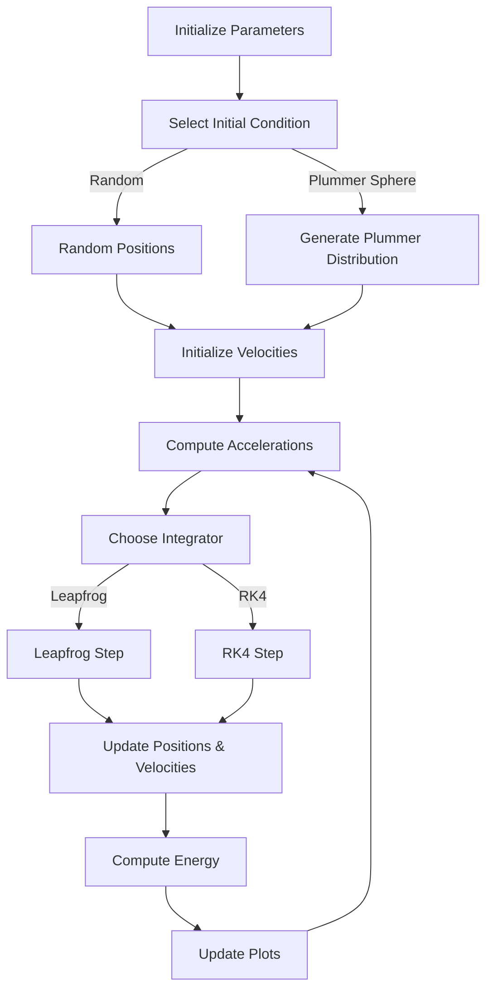

# Hamiltonian N-Body Simulator

An interactive, research-oriented **$N$-body simulation framework** for exploring **Hamiltonian dynamics**, gravitational clustering, and the performance of various **numerical integration schemes**. This project is designed both as an educational tool and as a platform for experimentation in computational astrophysics.

---

## Overview

This simulator models a system of $N$ equal-mass particles evolving under their mutual Newtonian gravitational interactions:

$$
\mathbf{F}_{ij} = - G \frac{m_i m_j}{r_{ij}^3} \, \mathbf{r}_{ij},
$$

where $G$ is the gravitational constant, and $\mathbf{r}_{ij}$ is the displacement vector between particles $i$ and $j$.

The system is evolved using **symplectic and non-symplectic integrators** to study conservation of the Hamiltonian (total energy):

$$
H = T + V = \sum_{i=1}^{N} \frac{1}{2} m_i \|\mathbf{v}_i\|^2 - \sum_{i<j} \frac{G m_i m_j}{\|\mathbf{r}_{ij}\|}.
$$

---

## Features

- **Multiple Integrators**
  - Leapfrog (symplectic)
  - 4th-order Runge-Kutta
  - (Planned) Forest–Ruth and Symplectic RK4

- **Initial Conditions**
  - Random uniform distribution
  - Plummer sphere profile
  - Two-body or galaxy collision setups (planned)

- **Visualization**
  - Real-time particle animation with matplotlib
  - Energy conservation plots
  - (Planned) angular momentum drift and density profiles

- **Interactivity**
  - Start/pause/reset simulation
  - Toggle integrators at runtime
  - Adjustable simulation parameters (particle number, timestep, mass, etc.)
  - Frametime output for performance benchmarking

---

## Flowchart



---

## Example Output

<p align="center">
  
</p>

*Figure 1: Plummer sphere evolution with Leapfrog integration (50 particles).*

---

## Installation

```bash
git clone https://github.com/yourusername/nbody-simulator.git
cd nbody-simulator
pip install -r requirements.txt
```

---

## Usage

Run the simulator:

```bash
python app.py
```

Options (to be implemented in UI):
- `--integrator` : choose from `leapfrog`, `rk4`, `forest-ruth`
- `--initial` : choose from `random`, `plummer`, `collision`
- `--N` : number of particles
- `--dt` : timestep

---

## Roadmap

- [ ] Add Forest–Ruth symplectic integrator  
- [ ] GPU acceleration (Numba or PyTorch MPS)  
- [ ] Fast multipole or Barnes–Hut approximation for $O(N \log N)$ scaling  
- [ ] Galaxy collision module  
- [ ] Comprehensive data analysis suite (angular momentum, radial density, etc.)  

---

## References

- Aarseth, S. J. (2003). *Gravitational N-Body Simulations*. Cambridge University Press.  
- Hernquist, L. (1990). *An analytical model for spherical galaxies and bulges*. ApJ.  
- Hut, P., Makino, J., & McMillan, S. (1995). *Starlab: A software environment for collisional dynamics*.  

---

## License

MIT License. See `LICENSE` for details.
